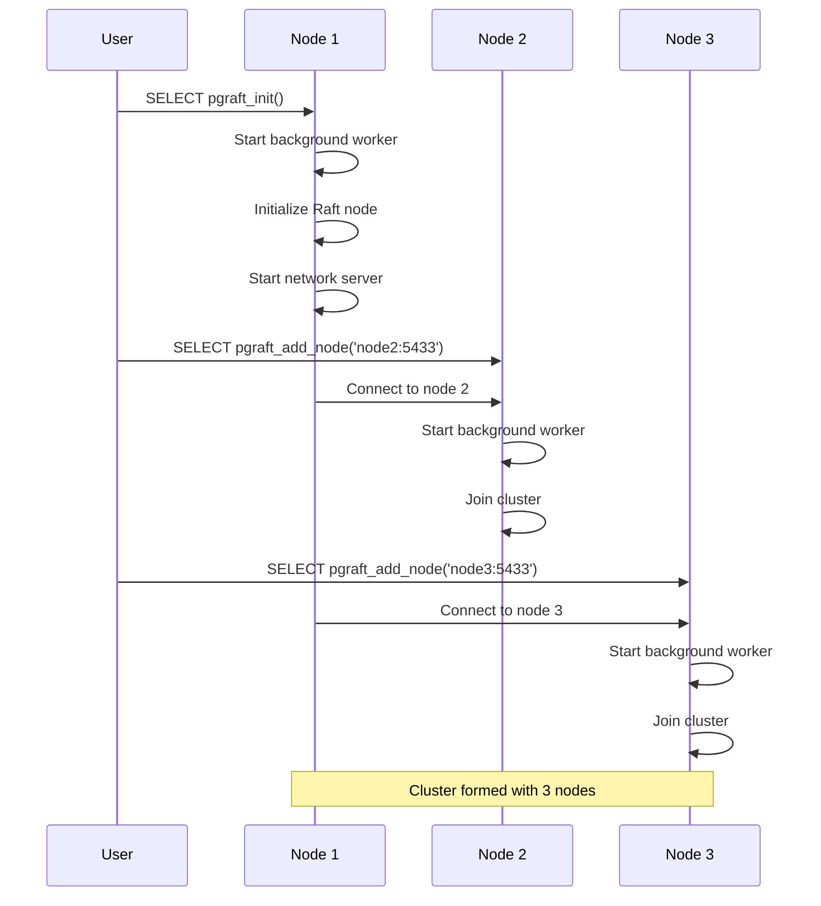
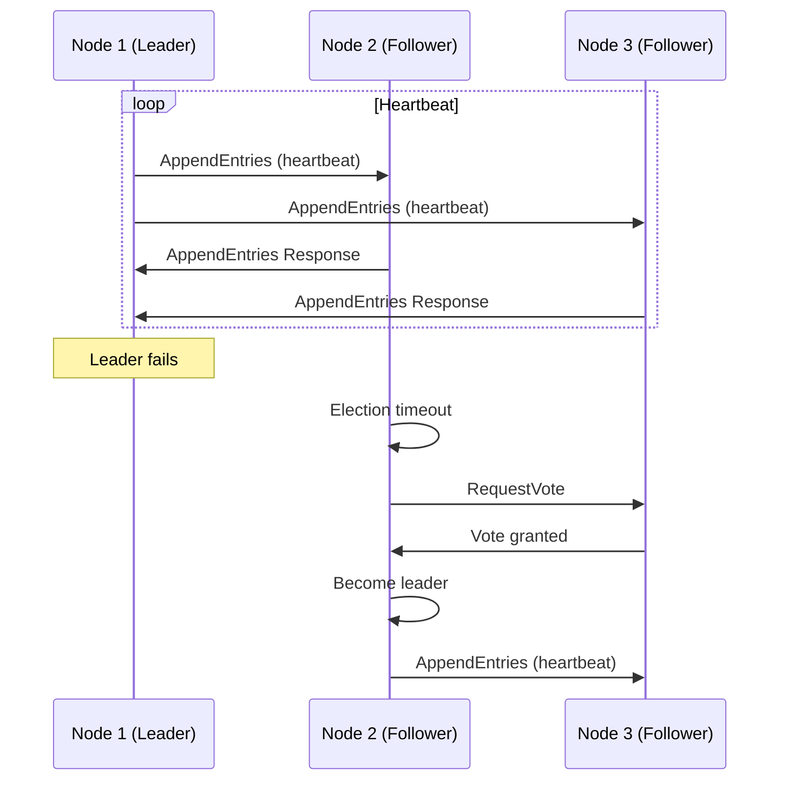
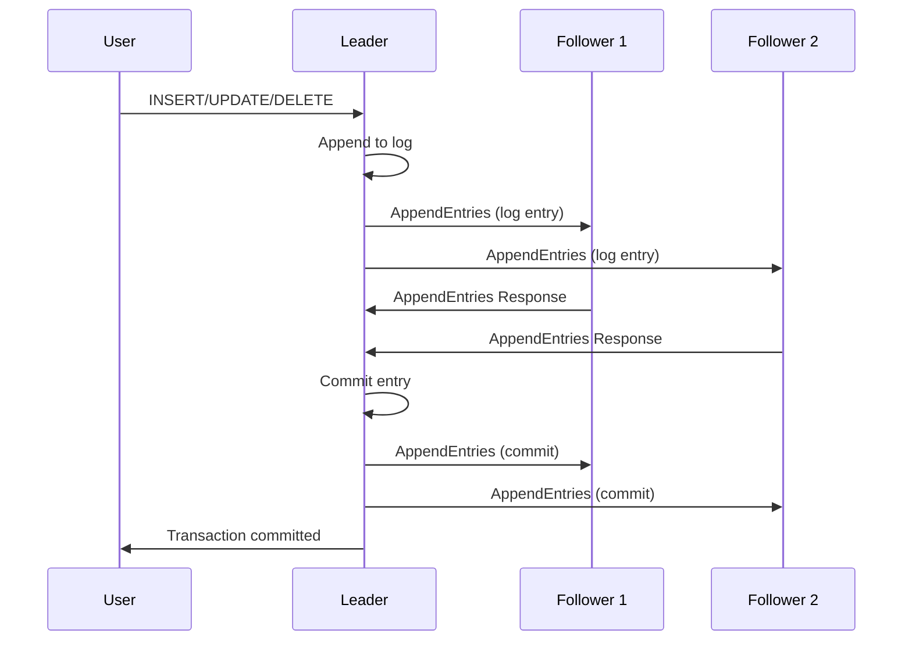

# pgraft System Architecture

## Overview

pgraft implements a distributed consensus system using the Raft algorithm integrated with PostgreSQL. This document describes the overall system architecture, component interactions, and operational flows.

## System Components

### 1. PostgreSQL Cluster Nodes
Each PostgreSQL instance in the cluster runs the pgraft extension and participates in the Raft consensus protocol.

### 2. Raft Consensus Layer
The core consensus engine implemented in Go, providing:
- Leader election
- Log replication
- Cluster membership management
- Failure detection and recovery

### 3. Network Communication
TCP-based peer-to-peer communication between cluster nodes for:
- Raft protocol messages
- Heartbeat signals
- Log replication
- Configuration changes

### 4. Shared Memory Interface
PostgreSQL shared memory used for:
- Command queue between SQL and background worker
- Cluster state persistence
- Worker status tracking
- Command status monitoring

## High-Level Architecture

```
┌─────────────────────────────────────────────────────────────────┐
│                    PostgreSQL Cluster                          │
├─────────────────┬─────────────────┬─────────────────────────────┤
│   Node 1        │   Node 2        │   Node 3                    │
│                 │                 │                             │
│ ┌─────────────┐ │ ┌─────────────┐ │ ┌─────────────┐             │
│ │ PostgreSQL  │ │ │ PostgreSQL  │ │ │ PostgreSQL  │             │
│ │   Server    │ │ │   Server    │ │ │   Server    │             │
│ └─────────────┘ │ └─────────────┘ │ └─────────────┘             │
│         │       │         │       │         │                   │
│ ┌───────▼───────┼─────────▼───────┼─────────▼───────┐           │
│ │   pgraft      │ │   pgraft      │ │   pgraft      │           │
│ │   Extension   │ │   Extension   │ │   Extension   │           │
│ └───────┬───────┼─────────┬───────┼─────────┬───────┘           │
│         │       │         │       │         │                   │
│ ┌───────▼───────┼─────────▼───────┼─────────▼───────┐           │
│ │ Background    │ │ Background    │ │ Background    │           │
│ │   Worker      │ │   Worker      │ │   Worker      │           │
│ └───────┬───────┼─────────┬───────┼─────────┬───────┘           │
│         │       │         │       │         │                   │
│ ┌───────▼───────┼─────────▼───────┼─────────▼───────┐           │
│ │ Go Raft       │ │ Go Raft       │ │ Go Raft       │           │
│ │   Library     │ │   Library     │ │   Library     │           │
│ └───────┬───────┼─────────┬───────┼─────────┬───────┘           │
│         │       │         │       │         │                   │
└─────────┼───────┼─────────┼───────┼─────────┼───────────────────┘
          │       │         │       │         │
          └───────┼─────────┼───────┼─────────┘
                  │         │       │
          ┌───────▼─────────▼───────▼───────┐
          │        Network Layer            │
          │    (TCP Peer Communication)     │
          └─────────────────────────────────┘
```

## Component Interaction Flow

### 1. Cluster Initialization



### 2. Leader Election Process



### 3. Log Replication



## Data Flow Architecture

### 1. Command Processing Flow

```
SQL Function → Command Queue → Background Worker → Go Raft Library → Network
     ↑                                                                    ↓
     └─────────── Command Status ← Shared Memory ← Raft State ←──────────┘
```

### 2. Shared Memory Layout

```
┌─────────────────────────────────────────────────────────────┐
│                    Shared Memory                            │
├─────────────────────────────────────────────────────────────┤
│  Worker State                                               │
│  ├─ Status (IDLE/INIT/RUNNING/STOPPING/STOPPED)           │
│  ├─ Node ID, Address, Port                                 │
│  ├─ Cluster Name                                           │
│  └─ Initialization Flags                                   │
├─────────────────────────────────────────────────────────────┤
│  Command Queue (Circular Buffer)                           │
│  ├─ Command Type (INIT/ADD_NODE/REMOVE_NODE/LOG_APPEND)   │
│  ├─ Command Data                                           │
│  ├─ Timestamp                                              │
│  └─ Queue Head/Tail Pointers                               │
├─────────────────────────────────────────────────────────────┤
│  Command Status FIFO                                       │
│  ├─ Command ID                                             │
│  ├─ Status (PENDING/PROCESSING/COMPLETED/FAILED)          │
│  ├─ Error Message                                          │
│  └─ Completion Time                                        │
├─────────────────────────────────────────────────────────────┤
│  Cluster State                                             │
│  ├─ Current Leader ID                                      │
│  ├─ Current Term                                           │
│  ├─ Node Membership                                        │
│  └─ Log Statistics                                         │
└─────────────────────────────────────────────────────────────┘
```

## Network Architecture

### 1. Peer-to-Peer Communication

```
┌─────────────┐    TCP    ┌─────────────┐    TCP    ┌─────────────┐
│   Node 1    │◄─────────►│   Node 2    │◄─────────►│   Node 3    │
│             │           │             │           │             │
│ Port: 5433  │           │ Port: 5434  │           │ Port: 5435  │
│ Raft Port:  │           │ Raft Port:  │           │ Raft Port:  │
│    8001     │           │    8002     │           │    8003     │
└─────────────┘           └─────────────┘           └─────────────┘
```

### 2. Message Types

- **RequestVote**: Candidate requesting votes during elections
- **AppendEntries**: Leader sending log entries and heartbeats
- **InstallSnapshot**: Leader sending snapshot to catch up slow followers
- **Heartbeat**: Regular leader-to-follower communication

## Failure Scenarios and Recovery

### 1. Leader Failure

```
Normal Operation → Leader Fails → Election Timeout → New Election → New Leader
```

### 2. Network Partition

```
Full Connectivity → Network Split → Partition A (majority) → Partition B (minority)
                                          ↓                        ↓
                                   Continues Operation      Stops Accepting Writes
```

### 3. Node Recovery

```
Node Down → Node Restarts → Joins Cluster → Catches Up Log → Active Participant
```

## Security Considerations

### 1. Network Security
- TCP connections between peers
- Configurable IP addresses and ports
- No built-in encryption (relies on network-level security)

### 2. Access Control
- PostgreSQL's native authentication
- Extension functions require appropriate privileges
- Shared memory access controlled by PostgreSQL

## Performance Characteristics

### 1. Latency
- Leader election: ~1-5 seconds (configurable)
- Log replication: Network RTT + disk I/O
- Heartbeat interval: 1 second (configurable)

### 2. Throughput
- Single leader handles all writes
- Followers can serve read-only queries
- Log replication limited by network bandwidth

### 3. Scalability
- Optimal with 3-5 nodes
- More nodes increase election time
- Network partitions affect availability

## Configuration Parameters

### 1. Network Settings
- `pgraft.listen_address`: IP address to bind
- `pgraft.listen_port`: Port for Raft communication
- `pgraft.peer_timeout`: Network timeout for peer connections

### 2. Raft Parameters
- `pgraft.heartbeat_interval`: Heartbeat frequency (ms)
- `pgraft.election_timeout`: Election timeout range (ms)
- `pgraft.max_log_entries`: Maximum log entries per batch

### 3. Operational Settings
- `pgraft.cluster_name`: Unique cluster identifier
- `pgraft.debug_enabled`: Enable debug logging
- `pgraft.health_period_ms`: Health check frequency

## Monitoring and Observability

### 1. Cluster Health
- Leader election status
- Node membership status
- Network connectivity
- Log replication lag

### 2. Performance Metrics
- Command processing latency
- Network message rates
- Memory usage
- Background worker status

### 3. Logging
- Raft protocol events
- Network communication
- Error conditions
- Performance statistics

## Deployment Considerations

### 1. Hardware Requirements
- Sufficient RAM for shared memory
- Network bandwidth for replication
- Disk I/O for log persistence
- CPU for consensus processing

### 2. Network Requirements
- Low-latency network between nodes
- Reliable network connectivity
- Sufficient bandwidth for replication
- Firewall configuration for peer ports

### 3. PostgreSQL Configuration
- Shared memory allocation
- Background worker limits
- Connection limits
- Logging configuration

This architecture provides a robust foundation for distributed PostgreSQL clusters with automatic failover, consistent replication, and high availability.