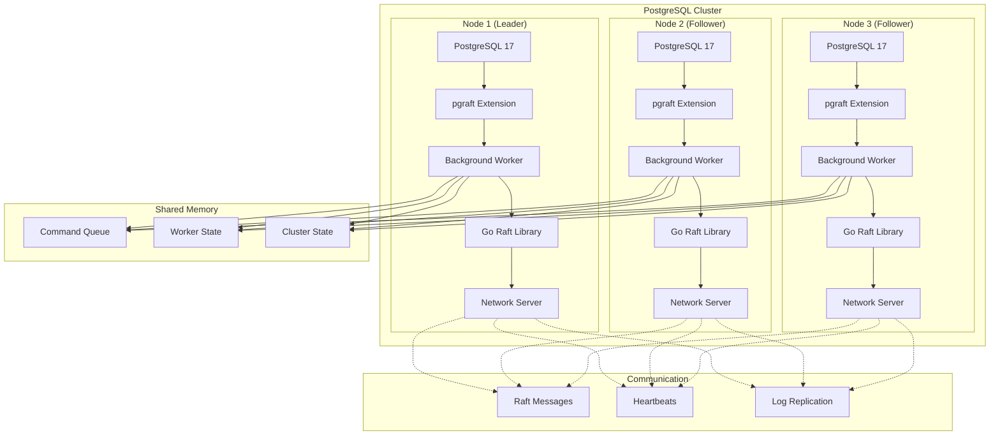
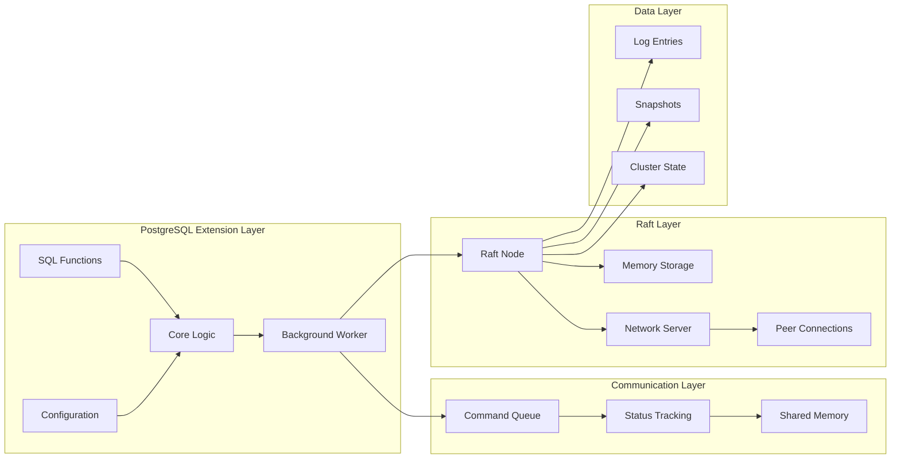
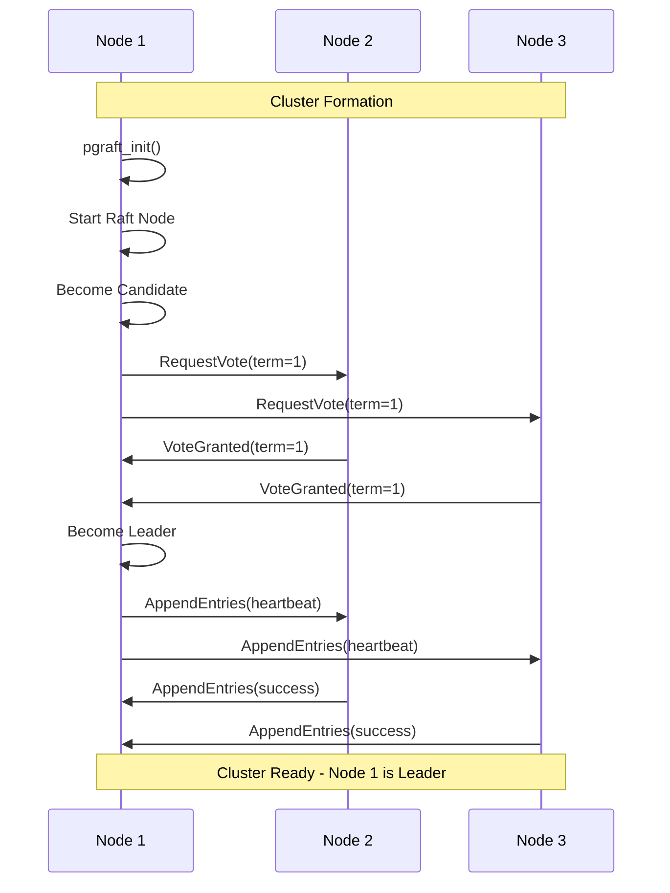
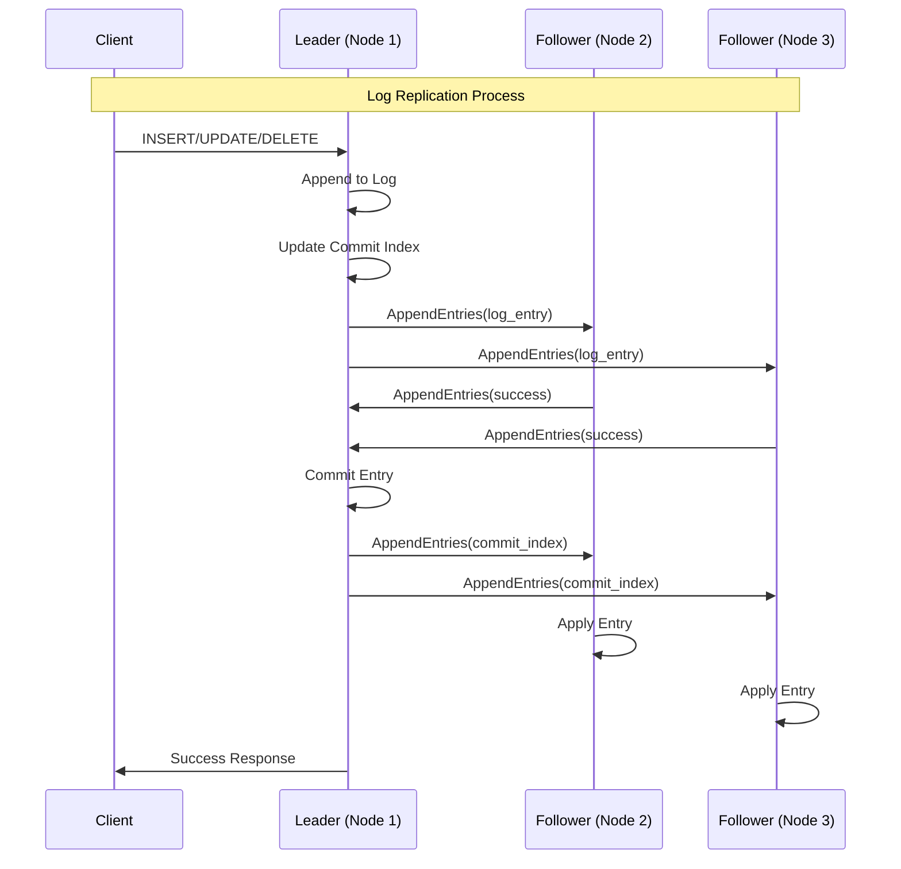
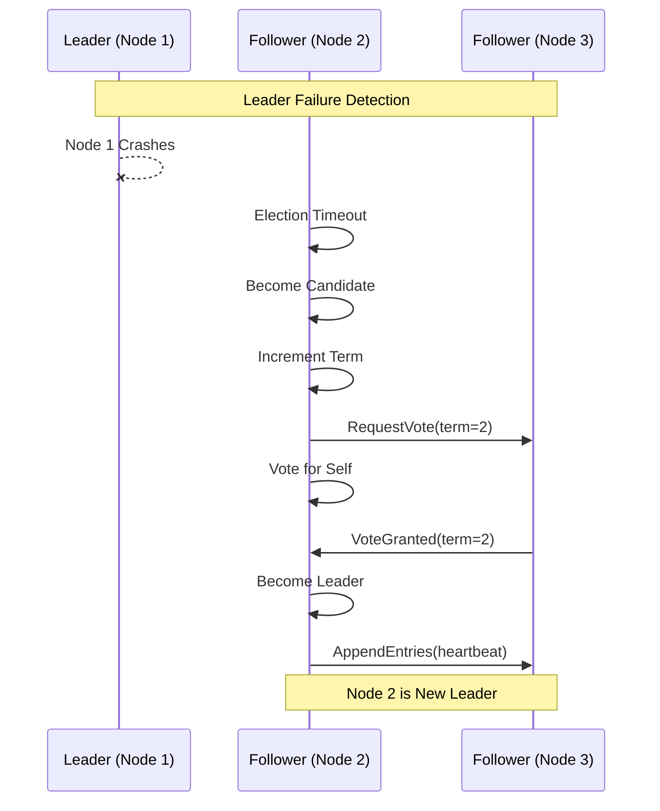

# pgraft - PostgreSQL Raft Consensus Extension

[](https://postgresql.org/)
[](LICENSE)
[](https://golang.org/)
[]()

**pgraft** is a high-performance PostgreSQL extension that implements Raft consensus protocol for distributed PostgreSQL clusters. It enables automatic leader election, log replication, and fault tolerance across multiple PostgreSQL instances.

## Features

- **Raft Consensus Protocol**: Implements the Raft algorithm for distributed consensus
- **Automatic Leader Election**: Seamless leader election and failover
- **Log Replication**: Consistent log replication across cluster nodes
- **High Availability**: Fault-tolerant cluster with automatic recovery
- **Zero-Downtime Operations**: Non-disruptive cluster operations
- **Go Integration**: Leverages Go's robust Raft implementation
- **PostgreSQL Native**: Built as a PostgreSQL extension with full SQL interface

## Table of Contents

- [Architecture](#architecture)
- [Installation](#installation)
- [Quick Start](#quick-start)
- [Configuration](#configuration)
- [SQL Interface](#sql-interface)
- [Cluster Management](#cluster-management)
- [Monitoring](#monitoring)
- [Troubleshooting](#troubleshooting)
- [Contributing](#contributing)
- [License](#license)

## Architecture

### System Architecture Overview



### Detailed Component Architecture



## Installation

### Prerequisites

- PostgreSQL 17+
- Go 1.21+
- GCC with C99 support
- Development headers for PostgreSQL

### Building from Source

```bash
# Clone the repository
git clone https://github.com/pgelephant/pgraft.git
cd pgraft

# Build the extension
make clean
make
make install

# Verify installation
make installcheck
```

### Configuration

Add to your `postgresql.conf`:

```ini
# Load the extension
shared_preload_libraries = 'pgraft'

# Node configuration
pgraft.node_id = 1
pgraft.address = '127.0.0.1'
pgraft.port = 5433
pgraft.cluster_name = 'my_cluster'

# Raft configuration
pgraft.heartbeat_interval = 1000
pgraft.election_timeout = 5000
pgraft.worker_enabled = true

# Optional settings
pgraft.debug_enabled = false
pgraft.health_period_ms = 5000
```

## Quick Start

### 1. Initialize the Cluster

```sql
-- Create the extension
CREATE EXTENSION IF NOT EXISTS pgraft;

-- Initialize the first node (leader)
SELECT pgraft_init();

-- Check cluster status
SELECT * FROM pgraft_get_cluster_status();
```

### 2. Add Additional Nodes

```sql
-- On each additional node, add peers
SELECT pgraft_add_node(2, '127.0.0.1', 5434);
SELECT pgraft_add_node(3, '127.0.0.1', 5435);

-- Check worker state
SELECT pgraft_get_worker_state();

-- View all nodes
SELECT * FROM pgraft_get_nodes();
```

### 3. Verify Cluster Health

```sql
-- Check if current node is leader
SELECT pgraft_is_leader();

-- Get current term
SELECT pgraft_get_term();

-- Get leader ID
SELECT pgraft_get_leader();

-- View cluster status
SELECT * FROM pgraft_get_cluster_status();
```

## Three-Node Cluster Operation

### Cluster Formation Process



### Log Replication Flow



### Leader Election Process



## Configuration

### GUC Variables

| Variable | Type | Default | Description |
|----------|------|---------|-------------|
| `pgraft.node_id` | int | 1 | Unique node identifier |
| `pgraft.address` | string | - | Node IP address |
| `pgraft.port` | int | 0 | Node communication port |
| `pgraft.cluster_name` | string | - | Cluster identifier |
| `pgraft.heartbeat_interval` | int | 1000 | Heartbeat interval (ms) |
| `pgraft.election_timeout` | int | 5000 | Election timeout (ms) |
| `pgraft.worker_enabled` | bool | true | Enable background worker |
| `pgraft.debug_enabled` | bool | false | Enable debug logging |
| `pgraft.health_period_ms` | int | 5000 | Health check interval |

### Example Configuration Files

**Node 1 (Leader) - postgresql.conf:**
```ini
port = 5433
shared_preload_libraries = 'pgraft'

pgraft.node_id = 1
pgraft.address = '127.0.0.1'
pgraft.port = 5433
pgraft.cluster_name = 'production_cluster'
pgraft.heartbeat_interval = 1000
pgraft.election_timeout = 5000
```

**Node 2 (Follower) - postgresql.conf:**
```ini
port = 5434
shared_preload_libraries = 'pgraft'

pgraft.node_id = 2
pgraft.address = '127.0.0.1'
pgraft.port = 5434
pgraft.cluster_name = 'production_cluster'
pgraft.heartbeat_interval = 1000
pgraft.election_timeout = 5000
```

**Node 3 (Follower) - postgresql.conf:**
```ini
port = 5435
shared_preload_libraries = 'pgraft'

pgraft.node_id = 3
pgraft.address = '127.0.0.1'
pgraft.port = 5435
pgraft.cluster_name = 'production_cluster'
pgraft.heartbeat_interval = 1000
pgraft.election_timeout = 5000
```

## SQL Interface

### Core Functions

#### Cluster Management

```sql
-- Initialize the extension
SELECT pgraft_init();

-- Add a node to the cluster
SELECT pgraft_add_node(node_id, address, port);

-- Remove a node from the cluster
SELECT pgraft_remove_node(node_id);

-- Get cluster status
SELECT * FROM pgraft_get_cluster_status();
```

#### Leader Operations

```sql
-- Check if current node is leader
SELECT pgraft_is_leader();

-- Get current leader ID
SELECT pgraft_get_leader();

-- Get current term
SELECT pgraft_get_term();

-- Get all nodes in cluster
SELECT * FROM pgraft_get_nodes();
```

#### Log Operations

```sql
-- Append a log entry
SELECT pgraft_log_append(term, data);

-- Commit a log entry
SELECT pgraft_log_commit(index);

-- Apply a log entry
SELECT pgraft_log_apply(index);

-- Get log statistics
SELECT * FROM pgraft_log_get_stats();
```

#### Monitoring

```sql
-- Get worker state
SELECT pgraft_get_worker_state();

-- Get command queue status
SELECT * FROM pgraft_get_queue_status();

-- Get replication status
SELECT * FROM pgraft_log_get_replication_status();

-- Sync with leader
SELECT pgraft_log_sync_with_leader();
```

### Return Types

#### Cluster Status Table
```sql
CREATE TYPE cluster_status AS (
    node_id integer,
    current_term bigint,
    leader_id bigint,
    state text,
    num_nodes integer,
    messages_processed bigint,
    heartbeats_sent bigint,
    elections_triggered bigint
);
```

#### Node Information Table
```sql
CREATE TYPE node_info AS (
    node_id integer,
    address text,
    port integer,
    is_leader boolean
);
```

## Monitoring

### Health Checks

```sql
-- Basic cluster health
SELECT 
    pgraft_is_leader() as is_leader,
    pgraft_get_term() as current_term,
    pgraft_get_leader() as leader_id;

-- Detailed cluster status
SELECT * FROM pgraft_get_cluster_status();

-- Worker health
SELECT pgraft_get_worker_state();

-- Log replication health
SELECT * FROM pgraft_log_get_replication_status();
```

### Performance Metrics

```sql
-- Log statistics
SELECT * FROM pgraft_log_get_stats();

-- Command queue status
SELECT * FROM pgraft_get_queue_status();

-- Cluster performance metrics
SELECT 
    messages_processed,
    heartbeats_sent,
    elections_triggered
FROM pgraft_get_cluster_status();
```

### Monitoring Dashboard Query

```sql
-- Comprehensive cluster overview
WITH cluster_status AS (
    SELECT * FROM pgraft_get_cluster_status()
),
node_info AS (
    SELECT * FROM pgraft_get_nodes()
),
log_stats AS (
    SELECT * FROM pgraft_log_get_stats()
)
SELECT 
    cs.node_id,
    cs.current_term,
    cs.leader_id,
    cs.state,
    cs.num_nodes,
    ni.address,
    ni.port,
    ni.is_leader,
    ls.log_size,
    ls.last_index,
    ls.commit_index,
    ls.last_applied
FROM cluster_status cs
LEFT JOIN node_info ni ON cs.node_id = ni.node_id
LEFT JOIN log_stats ls ON true;
```

## Cluster Management

### Starting a Cluster

1. **Start PostgreSQL instances:**
```bash
# Node 1
pg_ctl -D /data/node1 -o "-p 5433" start

# Node 2  
pg_ctl -D /data/node2 -o "-p 5434" start

# Node 3
pg_ctl -D /data/node3 -o "-p 5435" start
```

2. **Initialize the cluster:**
```sql
-- On each node
CREATE EXTENSION IF NOT EXISTS pgraft;
SELECT pgraft_init();
```

3. **Add nodes to cluster:**
```sql
-- On node 1 (initial leader)
SELECT pgraft_add_node(2, '127.0.0.1', 5434);
SELECT pgraft_add_node(3, '127.0.0.1', 5435);
```

### Scaling Operations

#### Adding a New Node

```sql
-- On the new node
CREATE EXTENSION IF NOT EXISTS pgraft;
SELECT pgraft_init();

-- On any existing node
SELECT pgraft_add_node(4, '127.0.0.1', 5436);
```

#### Removing a Node

```sql
-- Remove node from cluster
SELECT pgraft_remove_node(4);
```

### Maintenance Operations

#### Planned Maintenance

```sql
-- Check cluster health before maintenance
SELECT * FROM pgraft_get_cluster_status();

-- If current node is leader, maintenance will trigger election
-- No special action needed - cluster will handle failover
```

#### Cluster Restart

```sql
-- Graceful shutdown (on each node)
SELECT pgraft_log_sync_with_leader();

-- Restart PostgreSQL instances
-- Cluster will automatically re-form and elect new leader
```

## Troubleshooting

### Common Issues

#### 1. Worker Not Starting

**Symptoms:**
- `pgraft_get_worker_state()` returns "STOPPED"
- No leader election occurring

**Solutions:**
```sql
-- Check if extension is loaded
SELECT * FROM pg_extension WHERE extname = 'pgraft';

-- Check shared_preload_libraries
SHOW shared_preload_libraries;

-- Restart PostgreSQL if needed
-- Ensure pgraft is in shared_preload_libraries
```

#### 2. Network Connectivity Issues

**Symptoms:**
- Nodes can't communicate
- "No connection to peer" errors

**Solutions:**
```bash
# Test network connectivity
telnet 127.0.0.1 5434
telnet 127.0.0.1 5435

# Check firewall settings
sudo ufw status

# Verify port configuration
netstat -tlnp | grep 543
```

#### 3. Split-Brain Scenario

**Symptoms:**
- Multiple leaders
- Inconsistent cluster state

**Solutions:**
```sql
-- Check cluster state on all nodes
SELECT * FROM pgraft_get_cluster_status();

-- Manually resolve by restarting nodes
-- The Raft algorithm will elect a single leader
```

### Debug Mode

Enable debug logging for troubleshooting:

```sql
-- Enable debug mode
SELECT pgraft_set_debug(true);

-- Check logs
SELECT * FROM pgraft_get_queue_status();

-- Disable debug mode
SELECT pgraft_set_debug(false);
```

### Log Analysis

```sql
-- Check PostgreSQL logs for pgraft messages
-- Look for patterns like:
-- "pgraft: INFO - Cluster state update"
-- "pgraft: WARNING - Connection failed"
-- "pgraft: ERROR - Command failed"
```

## 📚 Advanced Usage

### Custom Log Replication

```sql
-- Append custom log entry
SELECT pgraft_log_append(1, '{"action": "user_created", "user_id": 123}');

-- Commit the entry
SELECT pgraft_log_commit(1);

-- Apply the entry
SELECT pgraft_log_apply(1);
```

### Cluster Configuration Management

```sql
-- Update cluster configuration
-- This is handled automatically by the Raft protocol
-- No manual intervention needed for configuration changes
```

### Performance Tuning

```sql
-- Adjust heartbeat interval for faster/slower heartbeats
-- Requires PostgreSQL restart
ALTER SYSTEM SET pgraft.heartbeat_interval = 500;

-- Adjust election timeout for faster/slower elections  
-- Requires PostgreSQL restart
ALTER SYSTEM SET pgraft.election_timeout = 3000;
```

## Contributing

We welcome contributions! Please see our [Contributing Guide](CONTRIBUTING.md) for details.

### Development Setup

```bash
# Clone the repository
git clone https://github.com/pgelephant/pgraft.git
cd pgraft

# Install development dependencies
make dev-setup

# Run tests
make test

# Run linting
make lint

# Build documentation
make docs
```

### Code Style

- Follow PostgreSQL C coding standards
- Use tabs for indentation
- Include proper error handling
- Add comprehensive tests
- Update documentation

## License

This project is licensed under the MIT License - see the [LICENSE](LICENSE) file for details.

## Acknowledgments

- [etcd-io/raft](https://github.com/etcd-io/raft) - Go Raft implementation
- PostgreSQL Global Development Group
- The open-source community

## Support

- Email: support@pgelephant.com
- Issues: [GitHub Issues](https://github.com/pgelephant/pgraft/issues)
- Documentation: [Wiki](https://github.com/pgelephant/pgraft/wiki)
- Discussions: [GitHub Discussions](https://github.com/pgelephant/pgraft/discussions)

---

**Made with love by the pgElephant team**